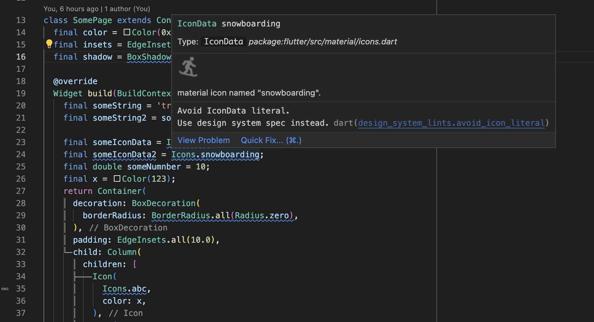

<p align="center">

# Sidecar Analyzer
*Enable a more personalized experience within your IDE.*



<a href="https://github.com/pattobrien/sidecar/actions"></a>
<a href="https://codecov.io/gh/pattobrien/sidecar"></a>
<a href="https://opensource.org/licenses/MIT"></a>
[](https://pub.dev/packages/sidecar)


## Table of Contents

- Motivations
- Getting Started
- Next steps

# Motivations and Objective

- TODO

# Getting Started

## Installing the CLI tool

Some Sidecar tasks are easier with the CLI tool. To install, simply run:

```sh
dart pub global activate sidecar
```

## Using Sidecar within a Dart or Flutter Project

There are 3 modes which Sidecar can be run in: server, cli, or debug (WIP).
### Server Mode

The Dart team maintains analysis servers that run in IDEs like VSCode. In Server mode, Sidecar boots up using the ```analyzer_plugin``` APIs created by the Dart team. 

To enable Sidecar to display lints and code actions within your IDE, perform the following the setup steps:

1. Depend on any ```sidecar``` lint packages such as ```design_system_lints```.

```yaml
dev_dependencies:
  design_system_lints: ^0.1.0-dev.1
```

2. Create a ```sidecar.yaml``` file at the project's root directory and declare any or all lints from the lint package (or use ```sidecar init``` to generate from a template)

```yaml
# sidecar.yaml
# file can also be created by running 'sidecar init' (sidecar cli needs to be installed)
includes:
  - "bin/**"
  - "lib/**"
lints:
  design_system_lints:
    avoid_sized_box_height_width_literals:
    avoid_text_style_literal:
    avoid_border_radius_literal:
    avoid_box_shadow_literal:
    avoid_edge_insets_literal:
```

3. Enable the ```sidecar``` plugin to run, by adding it to the list of plugins in ```analysis_options.yaml```.


```yaml
analyzer:
  plugins:
    - sidecar
```

After several seconds of start-up (and potentially a restart of your IDE), the lints should begin appearing in your editor.
### CLI Mode

CLI Mode is useful for running lint rules from a CI/CD pipeline. To use Sidecar in CLI mode, run the following command in your terminal:

```sh
# activate sidecar
dart pub global activate sidecar

# run sidecar analyzer in CLI mode
sidecar analyze
```

- TODO: elicit feedback for cli use cases

### Debug Mode (Work in Progress)

Debug Mode comes equipped with IDE debugger integration and hot reload, which is helpful for when you're developing your own lints. Currently, this functionality is a work-in-progress.

To enable debug mode, run:

```sh
sidecar analyze --debug
```


## Next Steps

- TODO: Roadmap
- TODO: Contributions / ways others can help by giving feedback on their use cases


## Feature Overview

### creating lint rules

- define a default severity for a lint
- documentation URLs in lint IDE window
- SidecarAstVisitor for simpler lint reporting (AstNodes and Tokens)
- TODO: ignore statements

### rules with code changes

- quick fixes for lints
- code assists
- TODO: code completion

### ```sidecar.yaml``` configuration

- define package or lint-specific includes paths
- explicitly enable or disable a lint
- override a rule's default severity
- lints update on ```sidecar.yaml``` changes, without plugin needing to restart

### cli

- output report of entire codebase
- TODO: output to different formats (e.g. csv)
- TODO: capture project metrics

### rule configurations
- TODO: allow rules to declare configurations
- TODO: display rule configuration errors in ```sidecar.yaml``` file
- TODO: rule annotations


### benchmarks and testing

- DONE: fix memory leaks
- TODO: Register visitors for better analysis performance
- TODO: lint unit test toolchain
- TODO: how can we benchmark against Dart official analysis server?
- TODO: cli takes ~12 seconds to complete

### extra features
- TODO: import inheritance
- TODO: multi-import inheritence
