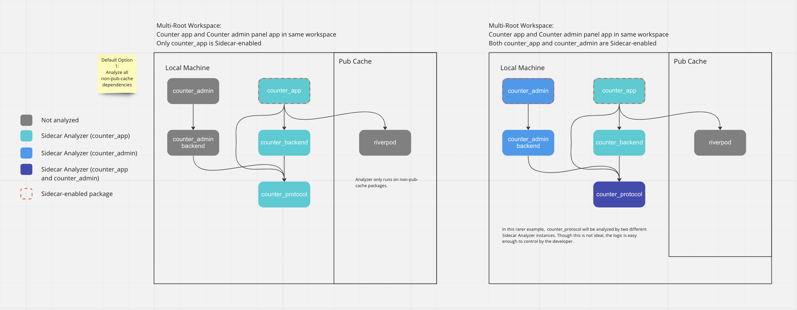

# Multi-Target Workspace (WIP)

> NOTE: for the purposes of this conversation, consider that by 'workspace', we mean all of the folders open in an IDE client. In this context, ```sidecar``` is running in IDE Server mode.

Even though sidecar is enabled by explicitly adding ```sidecar``` to analysis_options.yaml, its typical that we would want multiple Dart packages within our IDE's workspace to be analyzed. 

## Use Cases

TODO: finalize use cases

- we have a single (e.g. my_counter_app) at the workspace-root level that depends on several packages from path (within the current opened IDE workspace). users wish to analyze not only ```my_counter_app``` but all of the local IDE dependencies as well
- we have an admin panel UI in the same workspace as our mobile app. though these two Dart packages use many of the same dependencies, neither package relies on the other. however, when we define what ```sidecar``` rules we want to activate, we would typically do this at the root level of both/either app.

The question becomes: what is the easiest, most intuitive way to enable sidecar on many packages without explicitly declaring sidecar on every package?


## Example Workspaces

Two examples of a multi-root workspace:

<!--  -->



In the latter example, we want to enable linting on both our ```counter_admin``` app as well as the main customer-facing ```counter_app``` codebase. Since ```sidecar``` is designed to run on all local-dependencies (determined based on the package_config.json file of each Active Target app), then in this case, ```counter_protocol``` would be analyzed twice.

However, this is deemed as the most appropriate default behavior, for the following reasons:

- enabling sidecar for all local package_config.json dependencies is assumed to be more intuitive for developers, and likely is the most appealing default usecase
  - debugging this behavior would be easy, [relatively speaking](https://github.com/dart-lang/sdk/issues/48925#issuecomment-1113708351)
- we could allow granular control of which package dependencies are included in sidecar analysis, by implementing a sidecar.yaml feature that allows users to explicitly include / exclude certain packages from ```package_config.json```