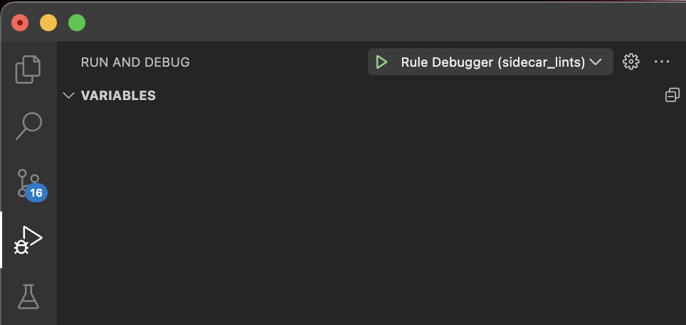

# Creating a Lint or QuickAssist Rule <a name="rule-package-usage"></a>

> Before creating a rule, it may be helpful to understand topics like AST, Elements, Types, etc. - which can be found in the [analyzer guides](analyzer_guides.md).

Below is an example of a Lint rule which highlights any string or string variable referenced from a Text widget.

```dart
//  package:intl_lints/src/hardcoded_text_string.dart

const packageId = 'intl_lints';
final kUri = 'https://github.com/pattobrien/lints/';

class HardcodedTextString extends Rule with Lint {
  static const _id = 'hardcoded_text_string';
  static const _message = 'Avoid any hardcoded Strings in Text widgets';
  static const _correction = 'Prefer to use a translated Intl message instead.';

  @override
  LintCode get code => LintCode(_id, package: packageId, url: kUri);

  @override
  void initializeVisitor(NodeRegistry registry) {
    registry.addInstanceCreationExpression(this);
  }

  @override
  void visitInstanceCreationExpression(InstanceCreationExpression node) {
    if (textType.isAssignableFromType(node.staticType)) {
      final textBody = node.argumentList.arguments
          .firstWhere((arg) => arg is! NamedExpression);
      if (textBody is SimpleStringLiteral || textBody is SimpleIdentifier) {
        reportAstNode(textBody, message: _message, correction: _correction);
      }
    }
  }
}

```

## Rule Requirements

The following are requirements for creating Rules that are discoverable by the Sidecar analyzer:

> NOTE: the package ```sidecar_lints``` can be used to enforce the below rules. See the [sidecar_lints](#sidecar_lints) section below for setup instructions.


### Rule Base Class
- All Sidecar rules must extend ```Rule``` as well as mixin either ```Lint``` or ```QuickAssist```
- All overridden visit methods should be added to the NodeRegistry via the ```initializeVisitor``` method (see above example)
- Lint rules expose methods ```reportAstNode``` and ```reportToken```, which take a  the AstNode/Token, a required message and an optional correction message to display to a user
- A QuickFix mixin can also be added to a Lint mixin, which exposes an extra parameter ```editsComputer``` on the functions ```reportAstNode``` and ```reportToken```
- The ```Rule``` base class also exposes other fields, for example ```unit``` ( ResolvedUnitResult that is currently being analyzed), ```sidecarSpec```, etc.


### RuleCode

- A RuleCode is the ID of every unique Sidecar Rule
- The ID of a RuleCode (e.g. ```hardcoded_text_string```) should be in snake_case format and should match the class name (in PascalCase)
- The Package ID of a RuleCode should be identical to the package name
- A URL can be added to the LintCode, which would then appear as a hyperlink in an IDE's lint window


### Rule Packages

- Sidecar rule packages can contain 1 or more rules
- For a given package ```intl_lints```, all rules must be accessible from the file ```lib/intl_lints.dart``` (either directly or via exports)
- ```pubspec.yaml``` should also declare any rules

```dart
//  package:intl_lints/intl_lints.dart

library intl_lints;

export 'src/hardcoded_text_string.dart';
export 'src/avoid_string_literal.dart';
```
```yaml
# pubspec.yaml
name: intl_lints
...

sidecar:
  lints:
    - hardcoded_text_string # should match the Lint's RuleCode ID
```


## Example Sidecar Rule Packages <a name="example-packages"></a>

To explore how rule packages are created, take a look at the following rule packages:

- [design_system_lints](https://pub.dev/packages/design_system_lints)
- [dart_lints](https://pub.dev/packages/dart_lints) - Sidecar port of the official Dart lints, for benchmarking purposes


## Additional Notes

> Some of the above API details, like the initializeVisitor method that must be overridden for each Rule, are admittedly verbose; our intention over time is to reduce as much redundancy as possible in order to make rule creation as straightforward as possible. If you have any feedback for how you'd like the APIs to look, we encourage you to open a Github issue.


## Debugging Lints

> NOTE: debugging is currently a WIP and only enabled for lint rules

Debug Mode is useful for interacting with the IDE debugger and developing using hot reload.

In order to debug lint or quick assist rules as you write them:

1. Add your Rule Package as a dependency to a new or existing Dart/Flutter app or package, and follow all of the other setup requirements in the [usage guide](using_rules_in_project.md). 

  - if you're creating rules to analyze a specific Dart or Flutter app, you can simply use that app as your debug target package
  - if you're creating rules to publish on ```pub.dev```, it would make most sense to create an example app at the package root, and use that example to test and debug your rules

2. If all was set up properly, you should see generated Sidecar files in the ```{target_root}/.dart_tool/sidecar/``` directory. In order to run Sidecar in debug mode, launch your debugger from the ```debug.dart``` file from within that directory.

For example, in VSCode, add the following content to the file ```{workspace_root}/.vscode/launch.json```:

```json
{ 
  [
    {
      // change this name to match your package name
      "name": "Rule Debugger (my_rule_package)",
      // swap the below path for the path of the app you wish to analyze
      "program": "packages/sidecar_lints/example/.dart_tool/sidecar/debug.dart", 
      "request": "launch",
      "type": "dart",
      "args": [
          "--enable-vm-service",
          "--debug",
      ],
    },
  ],
}
```

You should now see this debug option in the 'Run and Debug' menu in VSCode:




You can now debug your lint rules using breakpoints or any other debug feature included with the IDE's debugger. 

Additionally, every time you make a modification to a Target File under analysis, sidecar will re-compute lint results.


## Enabling sidecar_lints to assist with Rule creation <a name="sidecar_lints"></a>

Rather than relying on memory to follow all of the above rule requirements, the package [sidecar_lints](https://pub.dev/packages/sidecar_lints) will highlight any issues with your Rule definitions. To enable this package, follow the standard [usage guide](using_rules_in_project.md) for your rule package and in your ```sidecar.yaml``` file declare the rules avilable from the package:

```yaml
# sidecar.yaml at root of my_rule_package
includes:
  - "lib/**/*.dart"

lints:
  sidecar_lints:
    rules:
      missing_visit_method_registration:
      rule_not_declared:

```